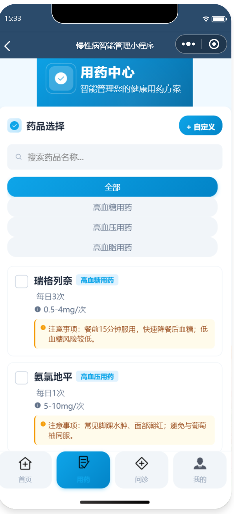
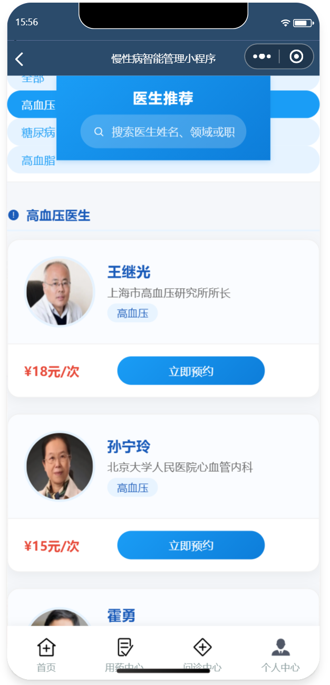
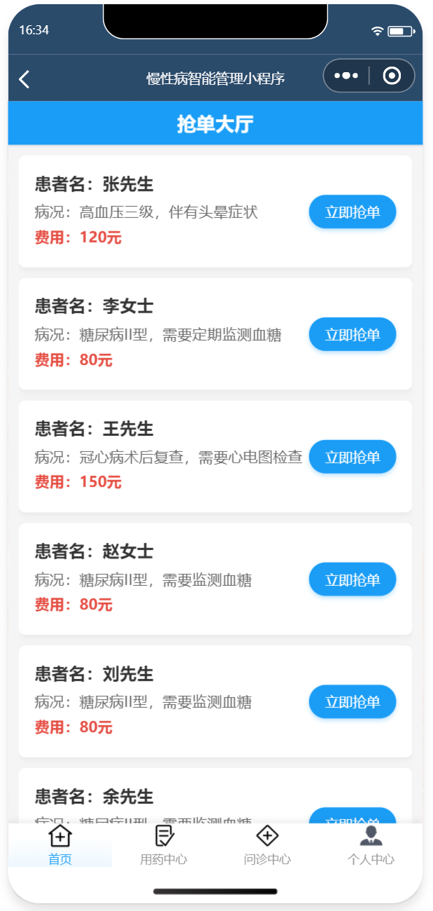
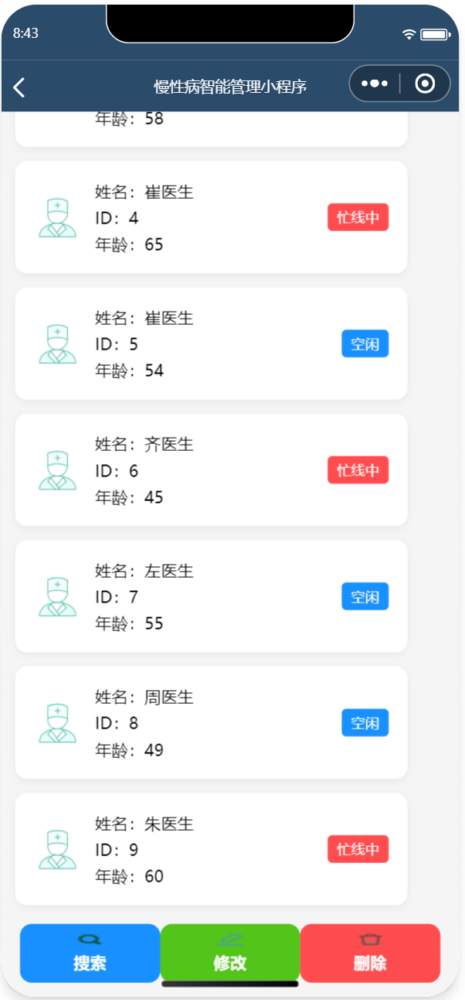
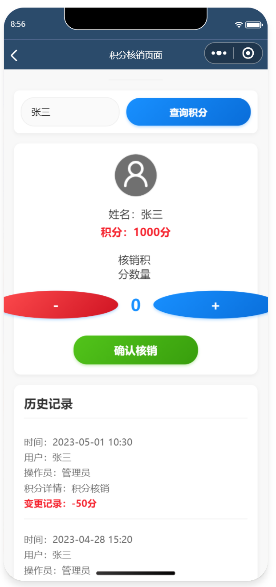
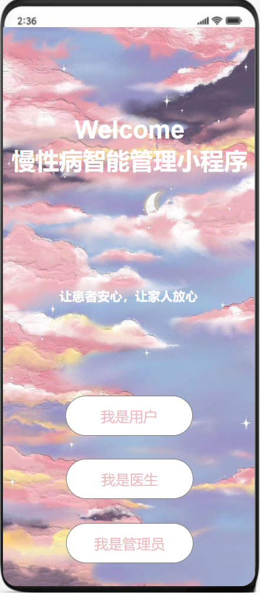

# 慢性病智能管理小程序

## 项目简介

一款基于微信开发者工具和云开发的慢性病智能管理小程序，覆盖患者健康监测、线上问诊、用药提醒、积分激励等功能，为患者和医生提供便捷的慢性病管理平台。

系统支持患者端、医生端、管理员端三端协同：
- 患者可上传血糖/血压/血脂数据、获取用药提醒、发起线上问诊、积分兑换奖品
- 医生可抢单接诊、在线开具处方、管理问诊收入
- 管理员可审核医生/患者信息、配置费用规则、核销积分

本项目来源于我的本科毕业论文《基于Node-Webkit慢性病智能管理小程序的设计与实现》。

## 我的角色

- 项目负责人，完成从需求分析到前后端开发的全流程
- 负责数据库建模、接口设计、前端页面实现
- 撰写 PRD 文档、绘制 Axure 原型图、完成系统测试与论文撰写

## 技术栈

| 层级 | 技术选型 |
|------|--------|
| 前端 | 微信小程序原生开发 + WXML / WXSS |
| 后端 | 微信云开发（云函数 + 云数据库） |
| 开发工具 | 微信开发者工具 |
| 跨平台 | Node-Webkit（实现桌面端封装） |

## 核心功能

| 角色 | 功能模块 | 具体功能 |
|------|--------|--------|
| 患者 | 监测记录 | 血糖/血压/血脂数据上传、AI健康咨询 |
| | 用药中心 | 查看处方、设置用药次数/剂量、开通用药提醒 |
| | 问诊中心 | 医生推荐、预约挂号、发布订单供医生抢单 |
| | 个人中心 | 我的医生/家属、健康报告、积分余额 |
| | 积分商城 | 使用积分兑换试纸、体检券等 |
| 医生 | 大厅抢单 | 实时查看患者订单并抢单接诊 |
| | 开处方 | 选择药品、填写用法用量、提交处方 |
| | 问诊中心 | 开具问诊报告、记录诊断结果 |
| | 个人中心 | 查看问诊收入、我的患者、历史报告 |
| 管理员 | 医生管理 | 导入/修改/删除医生信息 |
| | 患者管理 | 审核患者信息、修改/删除患者资料 |
| | 积分管理 | 核销患者兑换积分、查看积分流水 |
| | 费用管理 | 配置问诊费与月度服务费标准 |

## 数据库设计（关键表）

| 表名 | 主要字段 | 说明 |
|------|--------|------|
| 患者表 | userid, username, userillness, userintegral | 患者基本信息与积分 |
| 医生表 | doctornumble, doctorname, doctoroffice | 医生信息与科室 |
| 处方单 | usernumble, doctornumble, medicationdetails | 问诊处方记录 |
| 用药提醒表 | usernumble | 已开通提醒的患者 |
| 药品表 | drugnames, treatmenttype, dailyfrequency | 高血压/高血糖/高血脂药品库 |
| 管理员表 | adminid, adminpd, adminpassword | 管理员认证与权限 |

## 项目成果

- 完成患者端、医生端、管理员端共 10+ 核心页面开发
- 实现健康数据上传与阈值预警、AI 健康咨询、积分激励等关键业务闭环
- 系统已通过功能测试与可用性测试，获学院优秀项目展示资格
- 撰写 1.5 万字毕业论文，涵盖需求分析、系统设计、数据库建模、界面实现全流程

## 项目截图

### 登录界面（三端入口）


### 患者端 - 数据上传


### 患者端 - 用药中心


### 患者端 - 线上问诊


### 医生端 - 抢单大厅


### 医生端 - 开处方


### 管理员端 - 医生管理


### 管理员端 - 积分核销


## 原型图（Axure）

> 项目前期使用 Axure 完成了完整的原型设计，涵盖患者、医生、管理员三端所有核心页面。



## PRD 文档片段

### 需求背景
我国慢性病发病率持续上升，慢性病死亡人数占居民总死亡比例超过 80%。传统管理模式依赖线下随访，存在随访频率不足、患者依从性低等问题。本项目旨在通过信息化手段构建覆盖健康监测、用药管理、线上问诊、积分激励的闭环服务平台。

### 用户角色与核心诉求

| 角色 | 核心诉求 |
|------|--------|
| 患者 | 随时记录健康数据、获得用药提醒、便捷线上问诊 |
| 医生 | 高效接诊、查看患者档案、在线开具处方 |
| 管理员 | 保障数据真实有效、维护平台运营 |

## 如何运行

1. 下载并安装 [微信开发者工具](https://developers.weixin.qq.com/miniprogram/dev/devtools/download.html)
2. 克隆本仓库
   ```bash
   git clone https://github.com/your-repo/chronic-disease-management.git
