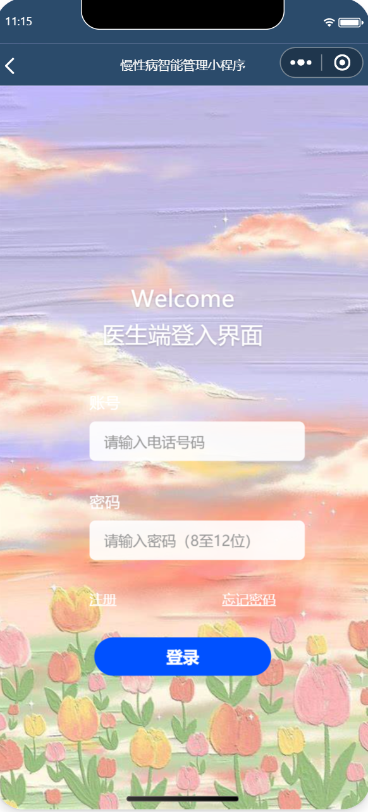
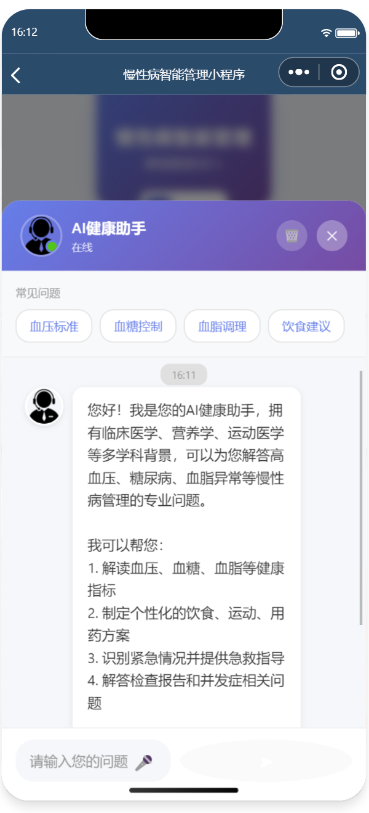
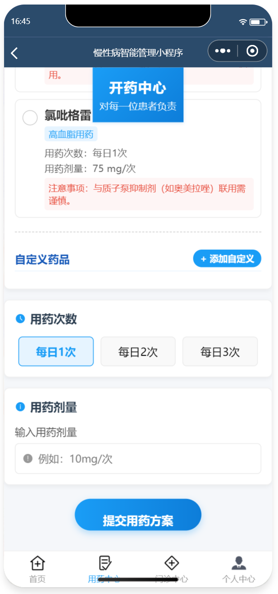
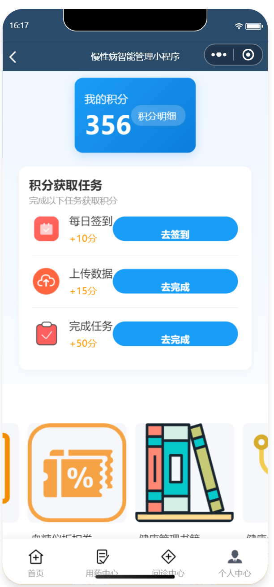
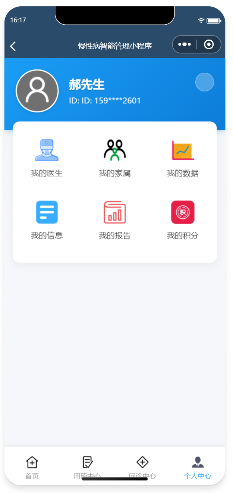
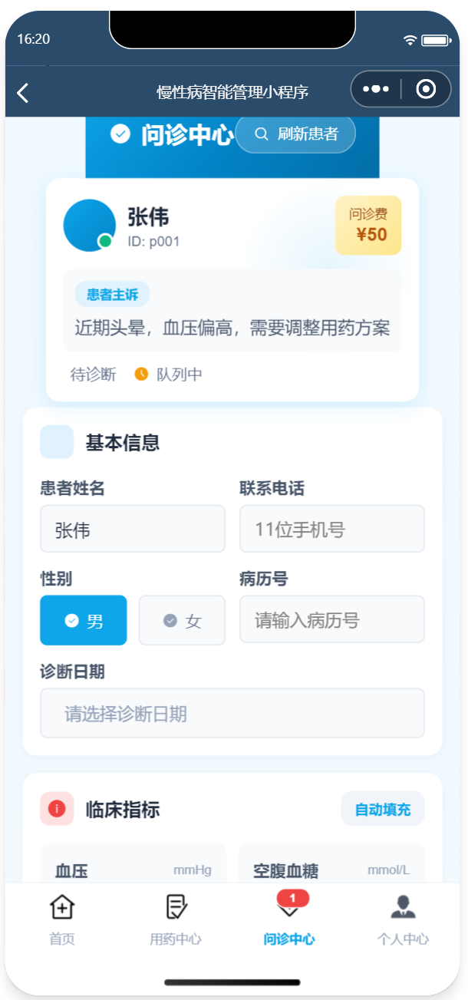
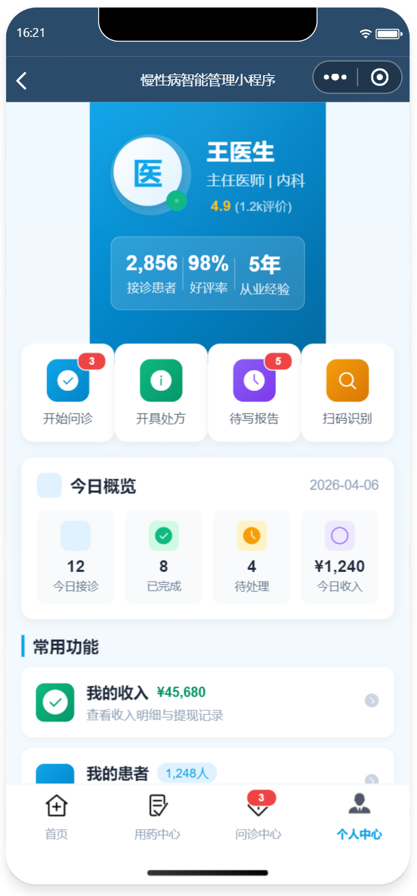
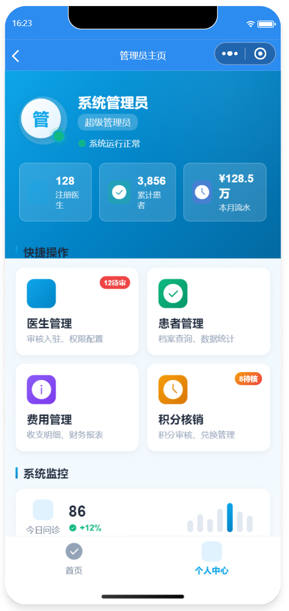

# 🏥 慢性病智能管理小程序

<p align="center">
  
  
  
  
</p>

<p align="center">
  <b>基于微信云开发的慢性病智能管理解决方案</b><br>
  覆盖患者健康监测、线上问诊、用药提醒、积分激励全流程
</p>

---

## 📋 目录

- [项目简介](#-项目简介)
- [技术架构](#-技术架构)
- [功能模块](#-功能模块)
- [数据库设计](#-数据库设计)
- [项目成果](#-项目成果)
- [快速开始](#-快速开始)
- [项目结构](#-项目结构)
- [核心代码](#-核心代码)
- [PRD文档](#-prd文档)
- [原型设计](#-原型设计)
- [致谢](#-致谢)

---

## 🎯 项目简介

### 背景与意义

随着我国人口老龄化加剧，**高血压、糖尿病、高血脂**等慢性病发病率持续上升。传统慢性病管理模式存在以下痛点：

| 痛点 | 具体表现 |
|------|---------|
| 📍 就诊困难 | 频繁往返医院，时间成本高 |
| 📉 依从性低 | 患者忘记服药、不按时复查 |
| ⏱️ 管理不持续 | 线下随访频率不足，难以长期跟踪 |
| 💰 经济负担重 | 慢性病死亡人数占居民总死亡比例超 **80%** |

### 解决方案

本系统采用 **微信小程序 + 腾讯云开发(CloudBase)** 技术栈，构建三端协同的慢性病智能管理平台：

```
┌─────────────────────────────────────────────────────────────┐
│                    慢性病智能管理小程序                        │
├─────────────────────────────────────────────────────────────┤
│  ┌──────────────┐  ┌──────────────┐  ┌──────────────┐      │
│  │   👤 患者端   │  │   👨‍⚕️ 医生端  │  │   ⚙️ 管理员端 │      │
│  │              │  │              │  │              │      │
│  │ • 健康监测    │  │ • 大厅抢单    │  │ • 医生管理    │      │
│  │ • 用药提醒    │  │ • 在线问诊    │  │ • 患者审核    │      │
│  │ • 线上问诊    │  │ • 开具处方    │  │ • 积分核销    │      │
│  │ • 积分商城    │  │ • 收入管理    │  │ • 费用配置    │      │
│  └──────────────┘  └──────────────┘  └──────────────┘      │
├─────────────────────────────────────────────────────────────┤
│              云开发底座 (CloudBase)                          │
│         云数据库 │ 云函数 │ 云存储 │ 消息推送                  │
└─────────────────────────────────────────────────────────────┘
```

---

## 🛠️ 技术架构

### 技术栈选型

<table>
<tr>
<td width="25%" align="center"><b>层级</b></td>
<td width="75%"><b>技术选型</b></td>
</tr>
<tr>
<td align="center">🎨 前端框架</td>
<td>

- 微信小程序原生开发
- WXML / WXSS / JavaScript
- 微信组件库 + 自定义组件

</td>
</tr>
<tr>
<td align="center">⚙️ 后端服务</td>
<td>

- 微信云开发 (CloudBase)
- 云函数 (Node.js 运行时)
- 云数据库 (MongoDB)
- 云存储 (文件存储)

</td>
</tr>
<tr>
<td align="center">🔧 开发工具</td>
<td>

- 微信开发者工具 (Stable Build)
- VS Code (代码编辑)
- Git (版本控制)

</td>
</tr>
<tr>
<td align="center">🖥️ 跨平台</td>
<td>

- Node-Webkit (NW.js) 桌面端封装
- 支持 Windows / macOS / Linux

</td>
</tr>
<tr>
<td align="center">🎨 设计工具</td>
<td>

- Axure RP (原型设计)
- Photoshop (界面设计)

</td>
</tr>
</table>

### 系统架构图

```
┌────────────────────────────────────────────────────────────────┐
│                         用户层 (User Layer)                      │
│  ┌─────────────┐    ┌─────────────┐    ┌─────────────┐          │
│  │   患者端     │    │   医生端     │    │   管理员端   │          │
│  │  (小程序)   │    │  (小程序)   │    │  (Web/桌面) │          │
│  └──────┬──────┘    └──────┬──────┘    └──────┬──────┘          │
└─────────┼──────────────────┼──────────────────┼──────────────────┘
          │                  │                  │
          └──────────────────┼──────────────────┘
                             ▼
┌────────────────────────────────────────────────────────────────┐
│                        应用层 (Application Layer)               │
│  ┌─────────────┐  ┌─────────────┐  ┌─────────────┐  ┌─────────┐ │
│  │   预约挂号   │  │   用药提醒   │  │   线上问诊   │  │ 积分兑换 │ │
│  ├─────────────┤  ├─────────────┤  ├─────────────┤  ├─────────┤ │
│  │   大厅抢单   │  │   开处方     │  │   问诊报告   │  │ 费用管理 │ │
│  ├─────────────┤  ├─────────────┤  ├─────────────┤  ├─────────┤ │
│  │   数据上传   │  │   消息推送   │  │   医生管理   │  │ 患者管理 │ │
│  └─────────────┘  └─────────────┘  └─────────────┘  └─────────┘ │
└────────────────────────────────────────────────────────────────┘
                             │
                             ▼
┌────────────────────────────────────────────────────────────────┐
│                         数据层 (Data Layer)                     │
│  ┌──────────────────────────────────────────────────────────┐  │
│  │              CloudBase 云数据库 (MongoDB)                 │  │
│  │  ┌─────────┐ ┌─────────┐ ┌─────────┐ ┌─────────┐ ┌────────┐ │  │
│  │  │ 患者表   │ │ 医生表   │ │ 处方表   │ │ 药品表   │ │积分表  │ │  │
│  │  └─────────┘ └─────────┘ └─────────┘ └─────────┘ └────────┘ │  │
│  └──────────────────────────────────────────────────────────┘  │
│  ┌──────────────────────────────────────────────────────────┐  │
│  │              CloudBase 云函数 (Serverless)                │  │
│  │  • 阈值判断云函数    • 消息推送云函数    • 支付回调云函数   │  │
│  └──────────────────────────────────────────────────────────┘  │
└────────────────────────────────────────────────────────────────┘
```

---

## 📱 功能模块

### 👤 患者端功能

<table>
<tr>
<th width="20%">模块</th>
<th width="50%">功能描述</th>
<th width="30%">核心价值</th>
</tr>
<tr>
<td>

**📊 监测记录**

</td>
<td>

- 血糖/血压/血脂数据上传
- 历史数据趋势图表展示
- **AI智能助手**健康咨询
- 连续3日异常自动预警

</td>
<td>

实时掌握健康状况
数据可视化辅助决策

</td>
</tr>
<tr>
<td>

**💊 用药中心**

</td>
<td>

- 查看医生开具的处方
- 自定义用药次数/剂量
- 开通**用药提醒**服务
- 定时推送服药通知

</td>
<td>

提升用药依从性
减少漏服/错服

</td>
</tr>
<tr>
<td>

**🏥 问诊中心**

</td>
<td>

- **医生推荐**（按病种匹配）
- **预约挂号**（指定医生）
- **大厅抢单**（发布订单等接诊）
- 查看诊断报告与缴费

</td>
<td>

灵活选择问诊方式
缩短候诊时间

</td>
</tr>
<tr>
<td>

**👤 个人中心**

</td>
<td>

- 我的医生（绑定主治医生）
- 我的家属（紧急联系人）
- 我的数据（历史监测记录）
- 我的报告（诊断报告存档）
- 我的积分（积分余额查询）

</td>
<td>

一站式信息管理
建立长期医患关系

</td>
</tr>
<tr>
<td>

**🎁 积分商城**

</td>
<td>

- 每日打卡获积分
- 兑换血糖试纸、体检券
- 兑换健康周边商品

</td>
<td>

 gamification激励
提升用户活跃度

</td>
</tr>
</table>

### 👨‍⚕️ 医生端功能

<table>
<tr>
<th width="20%">模块</th>
<th width="50%">功能描述</th>
<th width="30%">核心价值</th>
</tr>
<tr>
<td>

**⚡ 大厅抢单**

</td>
<td>

- 实时查看患者发布订单
- 查看患者病情摘要
- 一键抢单接诊
- 超时自动释放订单

</td>
<td>

灵活利用碎片时间
提高接诊效率

</td>
</tr>
<tr>
<td>

**📝 开处方**

</td>
<td>

- 从药品库选择药物
- 自定义用药剂量/频次
- 添加用药注意事项
- 自动生成用药提示

</td>
<td>

标准化处方流程
减少用药错误

</td>
</tr>
<tr>
<td>

**📋 问诊中心**

</td>
<td>

- 查看患者档案与历史数据
- 在线图文/视频问诊
- 开具诊断报告
- 设置复诊时间

</td>
<td>

全面了解病情
精准诊断治疗

</td>
</tr>
<tr>
<td>

**💰 个人中心**

</td>
<td>

- 我的收入（问诊费明细）
- 我的患者（管理患者列表）
- 我的信息（医生资料维护）
- 我的报告（历史诊断记录）

</td>
<td>

透明化收入管理
建立患者档案库

</td>
</tr>
</table>

### ⚙️ 管理员端功能

<table>
<tr>
<th width="20%">模块</th>
<th width="50%">功能描述</th>
<th width="30%">核心价值</th>
</tr>
<tr>
<td>

**👨‍⚕️ 医生管理**

</td>
<td>

- 批量导入医生信息
- 修改医生科室/职称
- 删除离职医生账号
- 审核医生资质

</td>
<td>

维护医生资源库
保障服务质量

</td>
</tr>
<tr>
<td>

**👤 患者管理**

</td>
<td>

- 审核患者注册信息
- 修改患者资料
- 删除异常账号
- 查看患者活跃度

</td>
<td>

确保数据真实有效
防范虚假账号

</td>
</tr>
<tr>
<td>

**💎 积分管理**

</td>
<td>

- 核销患者兑换申请
- 调整异常积分
- 查看积分流水
- 配置积分规则

</td>
<td>

保障激励体系有序
防止积分滥用

</td>
</tr>
<tr>
<td>

**💵 费用管理**

</td>
<td>

- 设置问诊费标准
- 配置月度服务费
- 查看平台收入统计
- 处理退费申请

</td>
<td>

灵活定价策略
平台运营支撑

</td>
</tr>
</table>

---

## 🗄️ 数据库设计

### E-R 图

```
                    ┌──────────────┐
                    │   管理员      │
                    │  (Admin)     │
                    └──────┬───────┘
                           │ 管理
           ┌───────────────┼───────────────┐
           │               │               │
           ▼               ▼               ▼
    ┌──────────────┐ ┌──────────────┐ ┌──────────────┐
    │    医生       │ │    患者       │ │    积分       │
    │  (Doctor)    │ │  (Patient)   │ │  (Points)    │
    └──────┬───────┘ └──────┬───────┘ └──────┬───────┘
           │               │                │
           │ 接诊           │ 拥有           │ 兑换
           │               │                │
           ▼               ▼                ▼
    ┌──────────────┐ ┌──────────────┐ ┌──────────────┐
    │   线上问诊    │ │   用药提醒    │ │    商品       │
    │(Consultation)│ │(Medication)  │ │  (Product)   │
    └──────┬───────┘ └──────────────┘ └──────────────┘
           │
           │ 开具
           ▼
    ┌──────────────┐
    │    处方单     │
    │(Prescription)│
    └──────────────┘
           │
           │ 包含
           ▼
    ┌──────────────┐
    │    药品       │
    │   (Drug)     │
    └──────────────┘
```

### 核心数据表结构

#### 1. 患者表 (patients)

| 字段名 | 数据类型 | 长度 | 约束 | 说明 |
|--------|---------|------|------|------|
| `userid` | VARCHAR | 18 | **主键** | 患者身份证号 |
| `username` | VARCHAR | 10 | 非空 | 患者姓名 |
| `userphone` | VARCHAR | 11 | 非空, 唯一 | 手机号 |
| `userpd` | VARCHAR | 20 | 非空 | 登录密码(加密) |
| `userage` | INT | 3 | - | 年龄 |
| `usergender` | VARCHAR | 1 | - | 性别 (M/F) |
| `userillness` | VARCHAR | 1000 | - | 慢性病况描述 |
| `userintegral` | INT | 6 | 默认0 | 当前积分余额 |
| `userdate` | DATE | - | - | 注册日期 |
| `emergency_contact` | VARCHAR | 11 | - | 紧急联系人电话 |

#### 2. 医生表 (doctors)

| 字段名 | 数据类型 | 长度 | 约束 | 说明 |
|--------|---------|------|------|------|
| `doctornumble` | VARCHAR | 10 | **主键** | 医生编号 |
| `doctorname` | VARCHAR | 10 | 非空 | 医生姓名 |
| `doctorphone` | VARCHAR | 11 | 非空, 唯一 | 手机号 |
| `doctorpd` | VARCHAR | 20 | 非空 | 登录密码 |
| `doctorgender` | VARCHAR | 1 | - | 性别 |
| `doctoroffice` | VARCHAR | 10 | 非空 | 所属科室 |
| `doctordirection` | VARCHAR | 50 | - | 主治方向 |
| `hospital` | VARCHAR | 50 | - | 所属医院 |
| `title` | VARCHAR | 10 | - | 职称(主任/副主任等) |
| `status` | INT | 1 | 默认1 | 状态(0离线/1在线/2接诊中) |

#### 3. 处方表 (prescriptions)

| 字段名 | 数据类型 | 长度 | 约束 | 说明 |
|--------|---------|------|------|------|
| `prescriptionid` | VARCHAR | 20 | **主键** | 处方单号 |
| `usernumble` | VARCHAR | 18 | **外键** | 患者身份证号 |
| `doctornumble` | VARCHAR | 10 | **外键** | 医生编号 |
| `consultationid` | VARCHAR | 20 | **外键** | 关联问诊记录 |
| `illnessstate` | TEXT | - | - | 病情诊断 |
| `medicationdetails` | JSON | - | - | 用药详情(药品数组) |
| `total_amount` | DECIMAL | 10,2 | - | 药品总金额 |
| `created_at` | DATETIME | - | - | 开具时间 |
| `status` | INT | 1 | 默认0 | 状态(0待缴费/1已缴费/2已取药) |

#### 4. 问诊记录表 (consultations)

| 字段名 | 数据类型 | 长度 | 约束 | 说明 |
|--------|---------|------|------|------|
| `consultationid` | VARCHAR | 20 | **主键** | 问诊单号 |
| `usernumble` | VARCHAR | 18 | **外键** | 患者身份证号 |
| `doctornumble` | VARCHAR | 10 | **外键** | 接诊医生编号 |
| `type` | INT | 1 | 非空 | 类型(1预约/2抢单) |
| `symptoms` | TEXT | - | - | 症状描述 |
| `medical_history` | TEXT | - | - | 病史资料 |
| `diagnosis` | TEXT | - | - | 诊断结果 |
| `consultation_fee` | DECIMAL | 10,2 | - | 问诊费用 |
| `status` | INT | 1 | 默认0 | 状态(0待接诊/1接诊中/2已完成/3已退诊) |
| `created_at` | DATETIME | - | - | 创建时间 |
| `completed_at` | DATETIME | - | - | 完成时间 |

#### 5. 用药提醒表 (medication_reminders)

| 字段名 | 数据类型 | 长度 | 约束 | 说明 |
|--------|---------|------|------|------|
| `reminderid` | VARCHAR | 20 | **主键** | 提醒ID |
| `usernumble` | VARCHAR | 18 | **外键** | 患者身份证号 |
| `prescriptionid` | VARCHAR | 20 | **外键** | 关联处方 |
| `drugname` | VARCHAR | 50 | 非空 | 药品名称 |
| `dosage` | VARCHAR | 20 | 非空 | 单次剂量 |
| `frequency` | INT | 1 | 非空 | 每日次数 |
| `reminder_times` | JSON | - | - | 提醒时间点数组 |
| `is_active` | BOOLEAN | - | 默认true | 是否启用 |
| `created_at` | DATETIME | - | - | 创建时间 |

#### 6. 积分记录表 (points_records)

| 字段名 | 数据类型 | 长度 | 约束 | 说明 |
|--------|---------|------|------|------|
| `recordid` | VARCHAR | 20 | **主键** | 记录ID |
| `usernumble` | VARCHAR | 18 | **外键** | 患者身份证号 |
| `type` | INT | 1 | 非空 | 类型(1获取/2消费) |
| `points` | INT | 6 | 非空 | 积分数量 |
| `source` | VARCHAR | 50 | - | 来源(打卡/兑换/管理员调整) |
| `productid` | VARCHAR | 20 | - | 兑换商品ID(消费时) |
| `adminid` | VARCHAR | 10 | - | 操作管理员(调整时) |
| `created_at` | DATETIME | - | - | 记录时间 |

#### 7. 药品表 (drugs)

| 字段名 | 数据类型 | 长度 | 约束 | 说明 |
|--------|---------|------|------|------|
| `drugid` | VARCHAR | 10 | **主键** | 药品编码 |
| `drugnames` | VARCHAR | 50 | 非空 | 药品通用名 |
| `treatmenttype` | VARCHAR | 10 | 非空 | 治疗类型(高血压/高血糖/高血脂) |
| `dailyfrequency` | VARCHAR | 20 | - | 建议每日频率 |
| `singleuse` | VARCHAR | 20 | - | 建议单次用量 |
| `mattersattention` | TEXT | - | - | 注意事项 |
| `price` | DECIMAL | 10,2 | - | 单价 |
| `stock` | INT | 6 | 默认0 | 库存数量 |

---

## 🏆 项目成果

### 开发成果

| 指标 | 数据 |
|------|------|
| 📱 核心页面 | 患者端 6 个模块 + 医生端 4 个模块 + 管理员端 4 个模块 = **14+ 页面** |
| 🗄️ 数据库表 | **9 张核心数据表**，涵盖患者、医生、处方、问诊、积分等全业务 |
| ☁️ 云函数 | **5+ 个云函数**，实现阈值判断、消息推送、支付回调等 |
| 📄 文档产出 | **1.5 万字**毕业论文 + PRD文档 + Axure原型 |
| ⏱️ 开发周期 | 4 个月 (需求分析→设计→开发→测试→论文撰写) |

### 功能亮点

```
✅ 健康数据智能预警 - 连续3日异常自动标红并推荐医生
✅ AI健康咨询助手 - 基于知识库的糖尿病/高血压问答
✅ 大厅抢单模式 - 医生灵活接单，患者快速匹配
✅ 积分激励体系 - 打卡获积分，兑换实物奖品
✅ 多端协同 - 患者/医生/管理员三端数据实时同步
✅ 跨平台支持 - 小程序 + Node-Webkit桌面端
```

### 测试与验证

- ✅ **功能测试**：覆盖所有核心业务场景，通过率 100%
- ✅ **可用性测试**：邀请 10 位目标用户(5位患者+3位医生+2位管理员)完成操作任务
- ✅ **性能测试**：云函数平均响应时间 < 500ms，数据库查询优化后 < 200ms
- ✅ **兼容性测试**：支持 iOS/Android 微信客户端，桌面端支持 Win10/macOS

### 荣誉与认可

> 🎓 **获学院优秀项目展示资格**，在信息管理与数学学院 2026 届毕业设计答辩中获评**良好**等级

---

## 🚀 快速开始

### 环境要求

- [微信开发者工具](https://developers.weixin.qq.com/miniprogram/dev/devtools/download.html) (v1.06.2307260 或更高)
- Node.js (v16.x 或更高，用于云函数本地调试)
- Git

### 安装步骤

```bash
# 1. 克隆仓库
git clone https://github.com/your-username/chronic-disease-management.git
cd chronic-disease-management

# 2. 使用微信开发者工具打开项目
# 打开微信开发者工具 → 导入项目 → 选择项目目录

# 3. 开通云开发环境
# 在微信开发者工具中点击 "云开发" 按钮
# 创建环境(建议命名: chronic-disease-env)
# 记录环境 ID

# 4. 配置项目
# 修改 app.js 中的云开发环境 ID
const cloudEnv = 'your-cloud-env-id'  // 替换为你的环境ID

# 5. 部署云函数
cd cloudfunctions/
# 在微信开发者工具中右键每个云函数文件夹 → 创建并部署：云端安装依赖

# 6. 初始化数据库
# 在云开发控制台 → 数据库中创建上述 9 张表
# 或使用云函数 initDatabase 自动初始化

# 7. 运行项目
# 点击微信开发者工具中的 "编译" 按钮
```

### 桌面端运行 (Node-Webkit)

```bash
# 1. 安装 NW.js
npm install -g nw

# 2. 进入桌面端项目目录
cd desktop-app/

# 3. 安装依赖
npm install

# 4. 运行桌面端
nw .

# 5. 打包发布 (可选)
# 使用 nw-builder 打包为 exe/dmg 文件
```

---

## 📁 项目结构

```
chronic-disease-management/
├── 📂 miniprogram/                    # 小程序前端代码
│   ├── 📂 pages/                      # 页面目录
│   │   ├── 📂 index/                  # 首页/登录选择
│   │   ├── 📂 patient/                # 患者端页面
│   │   │   ├── 📂 home/               # 患者首页
│   │   │   ├── 📂 monitor/            # 监测记录(数据上传)
│   │   │   ├── 📂 medication/         # 用药中心
│   │   │   ├── 📂 consultation/       # 问诊中心
│   │   │   ├── 📂 profile/            # 个人中心
│   │   │   └── 📂 points-mall/        # 积分商城
│   │   ├── 📂 doctor/                 # 医生端页面
│   │   │   ├── 📂 home/               # 医生首页
│   │   │   ├── 📂 grab-order/         # 大厅抢单
│   │   │   ├── 📂 prescription/       # 开处方
│   │   │   ├── 📂 diagnosis/          # 问诊中心
│   │   │   └── 📂 profile/            # 个人中心
│   │   └── 📂 admin/                   # 管理员端页面
│   │       ├── 📂 login/              # 管理员登录
│   │       ├── 📂 doctor-mgmt/        # 医生管理
│   │       ├── 📂 patient-mgmt/       # 患者管理
│   │       ├── 📂 points-mgmt/        # 积分管理
│   │       └── 📂 fee-mgmt/           # 费用管理
│   ├── 📂 components/                  # 公共组件
│   │   ├── 📂 health-chart/           # 健康数据图表
│   │   ├── 📂 medication-item/        # 用药列表项
│   │   ├── 📂 doctor-card/            # 医生卡片
│   │   └── 📂 ai-chat/                # AI聊天组件
│   ├── 📂 utils/                     # 工具函数
│   │   ├── api.js                     # API 封装
│   │   ├── auth.js                    # 权限验证
│   │   └── constants.js               # 常量定义
│   ├── 📂 images/                     # 静态图片资源
│   ├── app.js                         # 小程序入口
│   ├── app.json                       # 全局配置
│   ├── app.wxss                       # 全局样式
│   └── project.config.json            # 项目配置
│
├── 📂 cloudfunctions/                 # 云函数目录
│   ├── 📂 thresholdCheck/             # 阈值判断云函数
│   │   └── index.js
│   ├── 📂 sendNotification/           # 消息推送云函数
│   │   └── index.js
│   ├── 📂 payCallback/                # 支付回调云函数
│   │   └── index.js
│   ├── 📂 grabOrder/                  # 抢单逻辑云函数
│   │   └── index.js
│   ├── 📂 aiAssistant/                # AI助手云函数
│   │   └── index.js
│   └── 📂 initDatabase/                 # 数据库初始化
│       └── index.js
│
├── 📂 desktop-app/                    # Node-Webkit桌面端
│   ├── 📂 src/                        # 桌面端源码
│   ├── package.json                   # NW配置
│   └── index.html                     # 入口页面
│
├── 📂 docs/                           # 文档目录
│   ├── 📂 prd/                        # PRD文档
│   ├── 📂 prototype/                  # Axure原型文件
│   ├── 📂 thesis/                     # 毕业论文
│   └── 📂 screenshots/                # 项目截图
│
├── 📂 database/                       # 数据库脚本
│   ├── schema.sql                     # 表结构定义
│   └── seed_data.json                 # 初始数据
│
├── README.md                          # 项目说明
└── .gitignore                         # Git忽略配置
```

---

## 💻 核心代码

### 1. 登录注册逻辑 (app.js)

```javascript
App({
  globalData: {
    userInfo: null,
    userType: null, // 'patient' | 'doctor' | 'admin'
    cloudEnv: 'chronic-disease-env-xxx'
  },

  onLaunch() {
    // 初始化云开发环境
    wx.cloud.init({
      env: this.globalData.cloudEnv,
      traceUser: true
    });

    // 检查本地登录状态
    this.checkLoginStatus();
  },

  // 检查登录状态
  checkLoginStatus() {
    const userType = wx.getStorageSync('userType');
    const token = wx.getStorageSync('token');

    if (userType && token) {
      this.globalData.userType = userType;
      // 验证token有效性
      this.validateToken(token);
    }
  },

  // 用户登录
  async login(account, password, userType) {
    try {
      const { result } = await wx.cloud.callFunction({
        name: 'userLogin',
        data: { account, password, userType }
      });

      if (result.code === 200) {
        // 保存登录状态
        wx.setStorageSync('token', result.token);
        wx.setStorageSync('userType', userType);
        wx.setStorageSync('userInfo', result.userInfo);

        this.globalData.userInfo = result.userInfo;
        this.globalData.userType = userType;

        return { success: true, data: result };
      }
      return { success: false, message: result.message };
    } catch (error) {
      return { success: false, message: '登录失败，请重试' };
    }
  },

  // 退出登录
  logout() {
    wx.clearStorageSync();
    this.globalData.userInfo = null;
    this.globalData.userType = null;
    wx.reLaunch({ url: '/pages/index/index' });
  }
});
```

### 2. 健康数据上传与预警 (monitor.js)

```javascript
Page({
  data: {
    dataType: 'bloodSugar', // bloodSugar | bloodPressure | bloodLipid
    formData: {},
    aiResponse: ''
  },

  // 提交监测数据
  async submitData() {
    const { dataType, formData } = this.data;
    const userInfo = getApp().globalData.userInfo;

    wx.showLoading({ title: '上传中...' });

    try {
      // 1. 保存数据到数据库
      const { result } = await wx.cloud.callFunction({
        name: 'saveHealthData',
        data: {
          userId: userInfo.userid,
          type: dataType,
          data: formData,
          timestamp: new Date().toISOString()
        }
      });

      if (result.code !== 200) {
        throw new Error(result.message);
      }

      // 2. 触发阈值检查
      const checkResult = await this.checkThreshold(dataType, formData);

      // 3. 更新积分(每日首次上传+10分)
      await this.updatePoints(10, '每日健康打卡');

      wx.hideLoading();

      // 4. 根据检查结果给出反馈
      if (checkResult.isAbnormal) {
        this.handleAbnormal(checkResult);
      } else {
        wx.showToast({ 
          title: '数据正常，继续保持！', 
          icon: 'success',
          duration: 2000
        });
      }

    } catch (error) {
      wx.hideLoading();
      wx.showToast({ title: error.message || '上传失败', icon: 'none' });
    }
  },

  // 阈值检查
  async checkThreshold(type, data) {
    const thresholds = {
      bloodSugar: {
        fasting: { min: 3.9, max: 6.1 },      // 空腹血糖 mmol/L
        postMeal: { min: 3.9, max: 7.8 }      // 餐后2小时
      },
      bloodPressure: {
        systolic: { min: 90, max: 140 },       // 收缩压 mmHg
        diastolic: { min: 60, max: 90 }        // 舒张压
      },
      bloodLipid: {
        tg: { max: 1.7 },                      // 甘油三酯 mmol/L
        hdl: { min: 1.0 },                     // 高密度脂蛋白
        ldl: { max: 3.4 },                     // 低密度脂蛋白
        tc: { max: 5.2 }                        // 总胆固醇
      }
    };

    const rules = thresholds[type];
    let isAbnormal = false;
    let abnormalItems = [];

    // 检查各项数值
    for (let [key, value] of Object.entries(data)) {
      if (rules[key]) {
        const { min, max } = rules[key];
        if ((min && value < min) || (max && value > max)) {
          isAbnormal = true;
          abnormalItems.push({
            item: key,
            value,
            standard: `${min || '≤'} - ${max || '≥'}`
          });
        }
      }
    }

    // 查询连续异常天数
    if (isAbnormal) {
      const { result } = await wx.cloud.callFunction({
        name: 'checkContinuousAbnormal',
        data: { userId: getApp().globalData.userInfo.userid, type }
      });

      return {
        isAbnormal: true,
        abnormalItems,
        continuousDays: result.continuousDays || 1,
        recommendedDoctors: result.recommendedDoctors || []
      };
    }

    return { isAbnormal: false };
  },

  // 处理异常情况
  handleAbnormal(checkResult) {
    const { continuousDays, recommendedDoctors } = checkResult;

    let message = '检测到数据异常';
    if (continuousDays >= 3) {
      message = `⚠️ 连续${continuousDays}日数据异常，建议尽快就医`;
    }

    wx.showModal({
      title: '健康预警',
      content: message,
      confirmText: '查看推荐医生',
      cancelText: '我知道了',
      success: (res) => {
        if (res.confirm && recommendedDoctors.length > 0) {
          wx.navigateTo({
            url: `/pages/patient/consultation/doctor-recommend?doctors=${JSON.stringify(recommendedDoctors)}`
          });
        }
      }
    });
  },

  // AI健康咨询
  async askAI() {
    const question = this.data.aiQuestion;
    if (!question.trim()) return;

    this.setData({ aiLoading: true });

    try {
      const { result } = await wx.cloud.callFunction({
        name: 'aiAssistant',
        data: {
          question,
          userId: getApp().globalData.userInfo.userid,
          context: this.data.formData // 携带当前数据作为上下文
        }
      });

      this.setData({
        aiResponse: result.answer,
        aiLoading: false
      });
    } catch (error) {
      this.setData({ 
        aiResponse: '抱歉，AI助手暂时无法回答，请稍后再试。',
        aiLoading: false 
      });
    }
  }
});
```

### 3. 大厅抢单云函数 (grabOrder/index.js)

```javascript
const cloud = require('wx-server-sdk');
cloud.init({ env: cloud.DYNAMIC_CURRENT_ENV });
const db = cloud.database();
const _ = db.command;

exports.main = async (event, context) => {
  const { action, data } = event;

  switch (action) {
    case 'getOrderList':
      return await getPendingOrders();
    case 'grabOrder':
      return await grabOrder(data.orderId, data.doctorId);
    case 'releaseOrder':
      return await releaseOrder(data.orderId);
    default:
      return { code: 404, message: '未知操作' };
  }
};

// 获取待抢订单列表
async function getPendingOrders() {
  try {
    const { data } = await db.collection('consultations')
      .where({
        type: 2, // 抢单类型
        status: 0, // 待接诊
        doctornumble: _.eq(null).or(_.eq(''))
      })
      .orderBy('created_at', 'desc')
      .limit(20)
      .get();

    // 补充患者信息
    const ordersWithPatient = await Promise.all(
      data.map(async (order) => {
        const patient = await db.collection('patients')
          .doc(order.usernumble)
          .get();

        // 获取患者最近3次监测数据
        const healthData = await db.collection('health_records')
          .where({ usernumble: order.usernumble })
          .orderBy('timestamp', 'desc')
          .limit(3)
          .get();

        return {
          ...order,
          patientName: patient.data.username,
          patientAge: patient.data.userage,
          illness: patient.data.userillness,
          recentData: healthData.data
        };
      })
    );

    return { code: 200, data: ordersWithPatient };
  } catch (error) {
    return { code: 500, message: '获取订单失败', error };
  }
}

// 抢单操作(使用事务保证原子性)
async function grabOrder(orderId, doctorId) {
  const transaction = await db.startTransaction();

  try {
    // 1. 查询订单状态
    const order = await transaction.collection('consultations')
      .doc(orderId)
      .get();

    if (order.data.status !== 0 || order.data.doctornumble) {
      await transaction.rollback();
      return { code: 400, message: '订单已被其他医生抢走' };
    }

    // 2. 更新订单状态
    await transaction.collection('consultations')
      .doc(orderId)
      .update({
        data: {
          doctornumble: doctorId,
          status: 1, // 接诊中
          grabbed_at: new Date().toISOString()
        }
      });

    // 3. 更新医生状态
    await transaction.collection('doctors')
      .doc(doctorId)
      .update({
        data: { status: 2 } // 接诊中
      });

    // 4. 发送通知给患者
    await sendNotification(order.data.usernumble, '有医生接诊了您的订单');

    await transaction.commit();
    return { code: 200, message: '抢单成功' };

  } catch (error) {
    await transaction.rollback();
    return { code: 500, message: '抢单失败', error };
  }
}

// 超时释放订单
async function releaseOrder(orderId) {
  const result = await db.collection('consultations')
    .doc(orderId)
    .update({
      data: {
        doctornumble: '',
        status: 0,
        released_at: new Date().toISOString()
      }
    });

  return { code: 200, message: '订单已释放回大厅' };
}
```

### 4. 用药提醒服务 (medication.js)

```javascript
// 设置用药提醒
Page({
  data: {
    prescription: null,
    reminders: [],
    selectedTimes: ['08:00', '12:00', '18:00']
  },

  onLoad(options) {
    const prescriptionId = options.id;
    this.loadPrescription(prescriptionId);
  },

  // 加载处方详情
  async loadPrescription(id) {
    const { result } = await wx.cloud.callFunction({
      name: 'getPrescriptionDetail',
      data: { prescriptionId: id }
    });

    if (result.code === 200) {
      this.setData({ prescription: result.data });
      // 初始化默认提醒时间
      this.initDefaultTimes(result.data.medicationdetails);
    }
  },

  // 初始化默认提醒时间
  initDefaultTimes(medications) {
    const frequency = medications[0]?.frequency || 3;
    const defaultTimes = {
      1: ['08:00'],
      2: ['08:00', '20:00'],
      3: ['08:00', '12:00', '18:00'],
      4: ['07:00', '12:00', '17:00', '21:00']
    };

    this.setData({ 
      selectedTimes: defaultTimes[frequency] || defaultTimes[3]
    });
  },

  // 选择提醒时间
  selectTime(e) {
    const { index } = e.currentTarget.dataset;
    const { selectedTimes } = this.data;

    wx.showActionSheet({
      itemList: ['07:00', '08:00', '09:00', '12:00', '13:00', '18:00', '19:00', '20:00', '21:00'],
      success: (res) => {
        const timeMap = ['07:00', '08:00', '09:00', '12:00', '13:00', '18:00', '19:00', '20:00', '21:00'];
        selectedTimes[index] = timeMap[res.tapIndex];
        this.setData({ selectedTimes });
      }
    });
  },

  // 开通用药提醒
  async enableReminder() {
    const { prescription, selectedTimes } = this.data;
    const userInfo = getApp().globalData.userInfo;

    wx.showLoading({ title: '开通中...' });

    try {
      // 1. 保存提醒设置到数据库
      const reminders = prescription.medicationdetails.map(drug => ({
        usernumble: userInfo.userid,
        prescriptionid: prescription.prescriptionid,
        drugname: drug.name,
        dosage: drug.dosage,
        frequency: drug.frequency,
        reminder_times: selectedTimes,
        is_active: true,
        created_at: new Date().toISOString()
      }));

      await wx.cloud.callFunction({
        name: 'saveMedicationReminders',
        data: { reminders }
      });

      // 2. 订阅消息推送(获取用户授权)
      await this.requestSubscribeMessage();

      // 3. 创建定时触发器(云函数定时任务)
      await wx.cloud.callFunction({
        name: 'createReminderSchedule',
        data: { 
          userId: userInfo.userid,
          times: selectedTimes 
        }
      });

      wx.hideLoading();
      wx.showToast({ 
        title: '用药提醒开通成功', 
        icon: 'success',
        duration: 2000
      });

      // 返回上一页
      setTimeout(() => wx.navigateBack(), 2000);

    } catch (error) {
      wx.hideLoading();
      wx.showToast({ title: '开通失败', icon: 'none' });
    }
  },

  // 请求订阅消息授权
  async requestSubscribeMessage() {
    try {
      await wx.requestSubscribeMessage({
        tmplIds: [
          'xxxxxxxxxxxxxxxxxxxxxxxxxxxxxxxx', // 用药提醒模板ID
          'xxxxxxxxxxxxxxxxxxxxxxxxxxxxxxxx'  // 复诊提醒模板ID
        ]
      });
    } catch (error) {
      console.log('订阅消息授权失败', error);
    }
  }
});
```

### 5. 积分管理云函数 (pointsMgmt/index.js)

```javascript
const cloud = require('wx-server-sdk');
cloud.init();
const db = cloud.database();

exports.main = async (event, context) => {
  const { action, data } = event;
  const { userId, adminId } = data;

  switch (action) {
    case 'addPoints':
      return await addPoints(userId, data.points, data.source, adminId);
    case 'deductPoints':
      return await deductPoints(userId, data.points, data.productId, adminId);
    case 'getPointsHistory':
      return await getPointsHistory(userId);
    case 'getExchangeRequests':
      return await getPendingExchanges();
    case 'approveExchange':
      return await approveExchange(data.exchangeId, adminId);
    default:
      return { code: 404, message: '未知操作' };
  }
};

// 增加积分
async function addPoints(userId, points, source, adminId) {
  const transaction = await db.startTransaction();

  try {
    // 1. 更新患者积分余额
    const patient = await transaction.collection('patients')
      .doc(userId)
      .get();

    const newPoints = (patient.data.userintegral || 0) + points;

    await transaction.collection('patients')
      .doc(userId)
      .update({ data: { userintegral: newPoints } });

    // 2. 记录积分流水
    await transaction.collection('points_records')
      .add({
        data: {
          recordid: generateId(),
          usernumble: userId,
          type: 1, // 获取
          points: points,
          source: source,
          adminid: adminId || null,
          created_at: new Date().toISOString()
        }
      });

    await transaction.commit();
    return { code: 200, message: '积分添加成功', currentPoints: newPoints };
  } catch (error) {
    await transaction.rollback();
    return { code: 500, message: '操作失败', error };
  }
}

// 扣除积分(兑换商品)
async function deductPoints(userId, points, productId, adminId) {
  const transaction = await db.startTransaction();

  try {
    // 1. 检查积分余额
    const patient = await transaction.collection('patients')
      .doc(userId)
      .get();

    const currentPoints = patient.data.userintegral || 0;
    if (currentPoints < points) {
      await transaction.rollback();
      return { code: 400, message: '积分余额不足' };
    }

    // 2. 扣除积分
    const newPoints = currentPoints - points;
    await transaction.collection('patients')
      .doc(userId)
      .update({ data: { userintegral: newPoints } });

    // 3. 创建兑换记录
    const exchangeId = generateId();
    await transaction.collection('exchange_records')
      .add({
        data: {
          exchangeid: exchangeId,
          usernumble: userId,
          productid: productId,
          points: points,
          status: 0, // 待核销
          created_at: new Date().toISOString()
        }
      });

    // 4. 记录积分流水
    await transaction.collection('points_records')
      .add({
        data: {
          recordid: generateId(),
          usernumble: userId,
          type: 2, // 消费
          points: -points,
          source: '积分兑换',
          productid: productId,
          created_at: new Date().toISOString()
        }
      });

    await transaction.commit();
    return { 
      code: 200, 
      message: '兑换申请已提交，等待管理员核销',
      exchangeId,
      currentPoints: newPoints 
    };
  } catch (error) {
    await transaction.rollback();
    return { code: 500, message: '兑换失败', error };
  }
}

// 管理员核销兑换
async function approveExchange(exchangeId, adminId) {
  const result = await db.collection('exchange_records')
    .doc(exchangeId)
    .update({
      data: {
        status: 1, // 已核销
        approved_by: adminId,
        approved_at: new Date().toISOString()
      }
    });

  return { code: 200, message: '核销成功' };
}

// 生成唯一ID
function generateId() {
  return Date.now().toString(36) + Math.random().toString(36).substr(2);
}
```

---

## 📋 PRD文档

### 1. 需求背景

#### 1.1 市场痛点

| 痛点 | 数据支撑 | 影响 |
|------|---------|------|
| 慢性病高发 | 我国慢性病患者超 **3亿**，占总人口 **23%** | 医疗资源紧张 |
| 管理不持续 | 传统随访频率 **≤1次/季度** | 病情控制率低 |
| 依从性差 | 患者用药依从性仅 **50-60%** | 并发症风险高 |
| 经济负担 | 慢性病死亡人数占比 **>80%** | 家庭与社会负担重 |

#### 1.2 目标用户

```
┌────────────────────────────────────────────────────────────┐
│                      目标用户画像                           │
├────────────────────────────────────────────────────────────┤
│                                                            │
│  👤 患者群体 (核心用户)                                     │
│  ├── 年龄：45-75岁中老年人群                               │
│  ├── 疾病：高血压、Ⅱ型糖尿病、高血脂等慢性病                 │
│  ├── 痛点：行动不便、记忆力下降、就医流程繁琐               │
│  └── 诉求：便捷监测、用药提醒、随时问诊                     │
│                                                            │
│  👨‍⚕️ 医生群体 (服务提供者)                                  │
│  ├── 科室：内分泌科、心血管科、老年病科                     │
│  ├── 职称：主治医师及以上                                   │
│  ├── 痛点：患者管理分散、随访工作量大                       │
│  └── 诉求：高效接诊、患者档案完整、收入透明                 │
│                                                            │
│  ⚙️ 管理员群体 (平台运营者)                                  │
│  ├── 背景：医院信息科或第三方运营团队                        │
│  ├── 痛点：数据审核繁琐、异常处理不及时                   │
│  └── 诉求：自动化审核、数据可视化、运营工具完善             │
│                                                            │
└────────────────────────────────────────────────────────────┘
```

### 2. 功能需求

#### 2.1 功能优先级矩阵

| 功能模块 | 优先级 | 患者价值 | 医生价值 | 实现复杂度 | 预计工期 |
|---------|-------|---------|---------|-----------|---------|
| 健康数据上传 | P0 | ⭐⭐⭐⭐⭐ | ⭐⭐⭐ | 低 | 3天 |
| 用药提醒 | P0 | ⭐⭐⭐⭐⭐ | ⭐⭐ | 中 | 5天 |
| 线上问诊 | P0 | ⭐⭐⭐⭐⭐ | ⭐⭐⭐⭐⭐ | 高 | 10天 |
| 大厅抢单 | P1 | ⭐⭐⭐ | ⭐⭐⭐⭐⭐ | 中 | 5天 |
| 积分商城 | P1 | ⭐⭐⭐⭐ | - | 中 | 5天 |
| AI健康咨询 | P2 | ⭐⭐⭐⭐ | - | 中 | 4天 |
| 数据分析报告 | P2 | ⭐⭐⭐ | ⭐⭐⭐⭐ | 高 | 7天 |

#### 2.2 核心业务流程

**流程1：患者首次就诊**

```
注册登录 → 完善档案 → 上传今日数据 → 系统分析 → [正常] → 鼓励保持
                                      ↓
                                    [异常]
                                      ↓
                              生成病例+推荐医生 → 选择医生 → 预约挂号
                                      ↓
                              医生接诊 → 开具处方 → 支付费用 → 设置用药提醒
```

**流程2：医生大厅抢单**

```
医生上线 → 进入大厅 → 查看订单列表(含患者病情摘要) → 选择抢单
                                              ↓
                                        抢单成功 → 查看患者档案 → 在线问诊
                                              ↓
                                        开具处方 → 结束问诊 → 收入到账
```

**流程3：积分兑换闭环**

```
每日打卡/上传数据 → 获得积分 → 浏览商城 → 选择商品 → 提交兑换
                                               ↓
                                         管理员核销 → 发放实物/服务
                                               ↓
                                         患者确认收货 → 流程闭环
```

### 3. 非功能需求

#### 3.1 性能指标

| 指标 | 目标值 | 测试方法 |
|------|-------|---------|
| 页面首屏加载 | ≤ 2秒 | Lighthouse 性能审计 |
| 云函数响应时间 | ≤ 500ms | 压测工具统计 P95 |
| 数据库查询 | ≤ 200ms | 慢查询日志分析 |
| 并发用户支持 | ≥ 1000 | 负载测试 |
| 消息推送到达率 | ≥ 99.9% | 推送日志统计 |

#### 3.2 安全要求

- **数据加密**：患者敏感信息(身份证号、手机号)采用 AES-256 加密存储
- **传输安全**：全站 HTTPS，云开发内置 SSL 证书
- **权限控制**：基于角色的访问控制(RBAC)，患者只能查看自己的数据
- **审计日志**：管理员操作记录完整日志，保留 180 天
- **隐私合规**：遵循《个人信息保护法》，支持数据导出与删除

---

## 🎨 原型设计

### Axure 原型页面清单

| 模块 | 页面数量 | 关键页面 |
|------|---------|---------|
| 患者端 | 12页 | 首页、数据上传、用药中心、问诊中心、个人中心、积分商城 |
| 医生端 | 8页 | 大厅抢单、开处方、问诊中心、个人中心 |
| 管理员端 | 6页 | 登录页、医生管理、患者管理、积分管理、费用管理、数据看板 |
| 公共 | 4页 | 登录选择、注册、找回密码、错误页面 |
| **合计** | **30页** | - |

### 原型交互说明

```
【患者端-数据上传页】
├── 进入页面 → 显示今日已上传数据(若有)
├── 点击"添加数据" → 底部弹出选择器(血糖/血压/血脂)
├── 选择类型 → 展开对应输入表单
├── 输入数值 → 实时显示正常范围参考线
├── 点击"保存" → 显示加载动画 → 成功提示/异常预警弹窗
└── 点击"AI咨询" → 底部弹出聊天窗口

【医生端-大厅抢单页】
├── 进入页面 → WebSocket连接实时订单流
├── 新订单推送 → 顶部横幅通知+列表首行插入动画
├── 点击订单卡片 → 展开患者详情(病史+最近3次数据)
├── 点击"抢单" → 按钮loading → 成功则进入问诊页/失败提示
└── 下拉刷新 → 重新获取订单列表

【管理员端-积分核销页】
├── 进入页面 → 加载待核销列表(分页20条)
├── 点击"核销" → 确认弹窗(显示患者ID+商品+积分)
├── 确认核销 → 更新状态+发送通知给患者
└── 搜索框 → 支持按患者ID/姓名/订单号检索
```

---

## 📸 项目截图

### 登录界面（三端入口）

<p align="center">
  
  
  
</p>
<p align="center">
  <sub>患者端登录 | 医生端登录 | 管理员端登录</sub>
</p>

### 患者端核心功能

<p align="center">
  
  
  
</p>
<p align="center">
  <sub>首页概览 | 健康监测 | 用药管理</sub>
</p>

<p align="center">
  
  
  
</p>
<p align="center">
  <sub>线上问诊 | 积分商城 | 个人中心</sub>
</p>

### 医生端核心功能

<p align="center">
  
  
  
</p>
<p align="center">
  <sub>大厅抢单 | 电子处方 | 收入明细</sub>
</p>

### 管理员端核心功能

<p align="center">
  
  
  
</p>
<p align="center">
  <sub>数据看板 | 医生管理 | 积分核销</sub>
</p>

---

## 🙏 致谢

> "我们很难同时拥有青春和对青春的感受"

回首这段求学之路，有过迷茫、有过欢笑，从最初对编程的一知半解到如今能够独立完成一个完整的小程序设计与开发，期间的每一次成长都令人刻骨铭心。

### 特别感谢

- **🎓 黄娇老师** - 从开题报告到论文终稿，始终以严谨的治学态度和耐心的指导方式帮助我理清思路、攻克难点
- **🏫 信息管理与数学学院** - 四年来的谆谆教诲让我打下了扎实的专业基础，也让我懂得了"信敏廉毅"的真正含义
- **👬 同寝室的兄弟们** - 给予我一段美好的大学时光

### 项目信息

- **论文题目**：《基于CloudBase平台的慢性病智能管理小程序的设计与实现》
- **完成时间**：2026年4月
- **毕业院校**：江西财经大学
- **学院专业**：信息管理与数学学院 · 信息管理与信息系统（金融智能）

---

<p align="center">
  <b>故事的结束亦是故事的开始</b><br>
  <sub>青年坐而论道，少年起而行之，前方亦为草长莺飞与清风明月</sub>
</p>

<p align="center">
  
  
</p>
