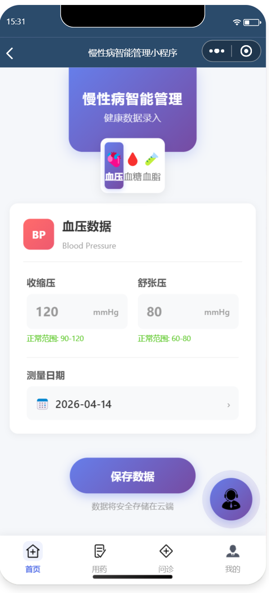

# chronic-disease-management
慢性病智能管理小程序 - 基于微信开发者工具的全栈项目
# 慢性病智能管理小程序

## 项目简介
一款基于微信开发者工具和云开发的慢性病智能管理小程序，覆盖患者健康监测、线上问诊、用药提醒、积分激励等功能，为患者和医生提供便捷的慢性病管理平台。

## 我的角色
- 项目负责人，完成从需求分析到前后端开发的全流程
- 负责数据库建模、接口设计、前端页面实现
- 撰写PRD文档、绘制Axure原型图

## 技术栈
- **前端**：微信小程序原生开发 + WeUI组件库
- **后端**：微信云开发（云函数 + 云数据库）
- **其他**：Node-Webkit实现跨平台运行

## 核心功能
| 角色 | 功能 |
|------|------|
| 患者 | 健康数据上传、线上问诊、用药提醒、积分兑换 |
| 医生 | 查看患者数据、开具处方、健康建议推送 |
| 管理员 | 用户管理、数据统计、内容审核 |

## 项目截图
> 在这里插入你的截图，建议每张截图配一行说明

### 患者端首页

### 健康监测页面

### 医生端数据可视化

## 原型图（Axure）
> 如果你有原型图，放在这里

## PRD文档片段
> 可以截图或直接粘贴核心内容

### 需求背景
慢性病患者需要长期管理，传统线下模式耗时耗力，线上平台可提升患者依从性和医疗效率。

### 用户角色
- 患者：核心使用者
- 医生：服务提供者
- 管理员：系统维护者

### 数据库表结构（关键表）
| 表名 | 字段 |
|------|------|
| users | openid, role, name, phone |
| health_records | userId, bloodPressure, bloodSugar, recordTime |
| prescriptions | doctorId, patientId, medicine, dosage |

## 项目成果
- 完成患者端、医生端、管理员端全功能开发
- 实现数据可视化看板，帮助医生快速掌握患者情况
- 获学院优秀项目展示资格

## 如何运行
> （如果你愿意，可以写运行步骤，但小程序需要AppID，招聘方通常只看截图和代码结构）

1. 下载微信开发者工具
2. 克隆本仓库
3. 在开发者工具中导入项目，填入自己的AppID
4. 开通云开发环境
5. 编译运行

## 联系方式
- 邮箱：haozujian@qq.com
- 电话：15946902601
